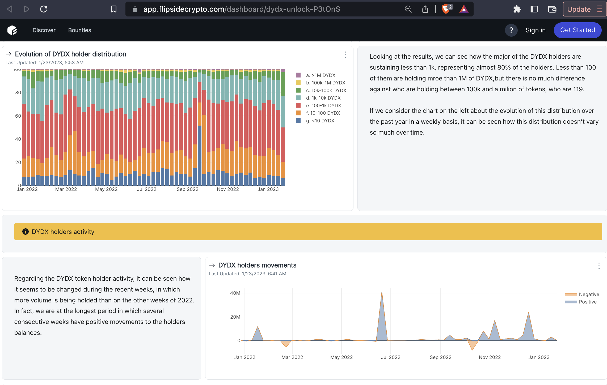
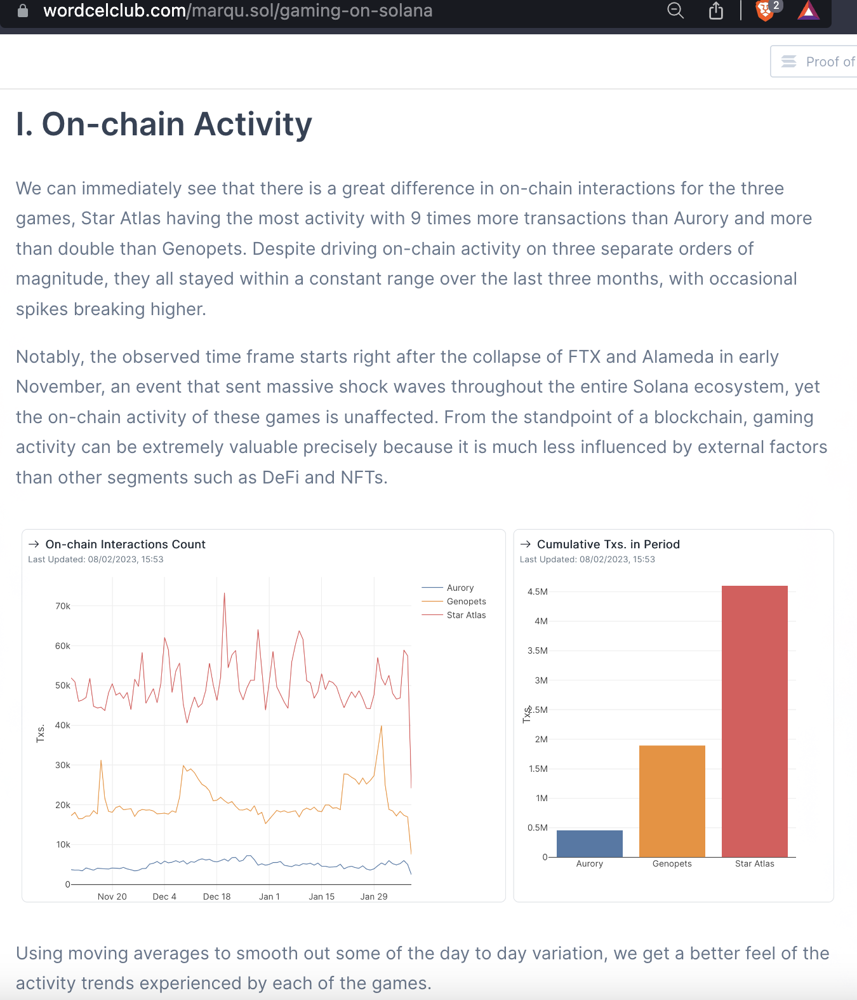

# 1. Do: Decide on the broad type of dashboard

There are nearly endless types of possible data outputs. As a community analyst of blockchain data, you can often expect to build either:

### **A** “**dashboard” in the more traditional sense**

A web page that displays the main metrics of interest in one place. It can have interactive features like tabs, filters, and/or parameters. This is a tool that lets the user quickly assess or continuously monitor key data on a protocol, a project, or an entire blockchain. A helpful resource on dashboard design is the book Information Dashboard Design: Displaying Data for At-a-glance Monitoring by Stephen few ([full details at the end in the Resources section](../resources.md)).

**Example**\
****[https://sociocrypto.gitlab.io/optimism/index.html](https://sociocrypto.gitlab.io/optimism/index.html) by [SocioCrypto](https://twitter.com/SocioCrypto)

<figure><figcaption></figcaption></figure>

### **A** **data storytelling dashboard or article**

Here you likely have a prompt that you are elaborating on (whether a bounty prompt or self-directed), data visualizations that you draw meaning from, the insights or takeaways that you spotlight, and possibly a background or method on how you arrived at them (and why that background is important). A person looking at this dashboard may be after this very specific question and answer, or they might just be looking for valuable, newsworthy, and entertaining takeaways about the web3 space. This might be made with a dashboard tool e.g. on Flipside or Dune etc., or it can be an article on Mirror or Medium etc. with embedded or screenshotted+linked charts.

**Examples**\
****[https://app.flipsidecrypto.com/dashboard/dydx-unlock-P3tOnS](https://app.flipsidecrypto.com/dashboard/dydx-unlock-P3tOnS) by [adriaparcerisas](https://twitter.com/adriaparcerisas)

<figure><figcaption></figcaption></figure>

[https://www.wordcelclub.com/marqu.sol](https://www.wordcelclub.com/marqu.sol) by [Marqu](https://twitter.com/k2rbpz)

<figure><figcaption></figcaption></figure>

### **When to choose one over the other?**

In the analytics challenge environment, the bounty question will often do the work for you. E.g. a “megadash” is an example of the first category. On the other hand, a question prompt such as “_How has this frictionless experience impacted Axelar’s token transfer volume via their native bridge Satellite?_” (from [Axelar question 4 “New Kid on the Block](https://www.notion.so/Bounty-Programs-d4bac7f1908f412f8bf4ed349198e5fe)”) calls for a data storytelling output.

Outside of the bounty environment, your clients or stakeholders will likely be looking for one of these over the other, depending on their goals (to display/monitor data, or to deep dive and answer a question).

In data circles, you will commonly hear that your intended **audience** needs to be top of mind as you create and communicate outputs. However, when it comes to analytics challenges, there is a catch. For best results, your work is expected to serve several audiences at once, from peer reviewers who score it, to eager tweeters on Crypto Twitter, to someone who might be looking for a data freelancer or full-time team member, and more. This is a challenging place to be in, and something you probably experienced already, or at least saw other analysts face. The plus side is that you get a chance to define what a successful multi-audience output looks like, and hone your grasp on the best practices you can continue carrying with you throughout your data career.
