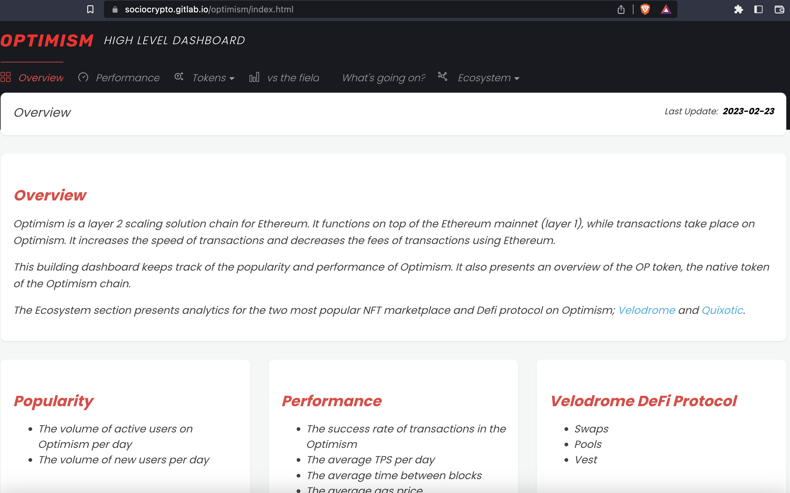

# 3. Do: Define and deliver on your purpose

Get clear with yourself what you want to accomplish with your analytical output. This goes hand in hand with the 2 Dos above: What the type of dashboard is and who you are envisioning to get value from it.

**Think beyond the peer reviewers.** When you put your dashboard out into the world, be it on Twitter or when the partner protocol who commissioned the analytics challenge receives the results – **who do you envision using your work and how?**

After you get clear on this with yourself, mention directly in your dashboard who you believe will benefit most from it and how, and then deliver on this value.

Are you creating a dashboard to monitor metrics?

* Think about who might find it useful, and what specific metrics they will need. Is it the protocol themselves? Can it be that different teams at the protocol will want different data? Can you separate it out by sections for them?
* Include a **very short About section** that briefly tells your users what data they will find and how they can use it.
* Imagine you are seeing the dashboard for the first time - is it **intuitive and easy to navigate**? E.g. does everyone know how to use parameters? Are they going to find their way around sections or tabs?
* **Ensure the data loads quickly** (one great suggestion is the [10-second rule](https://discord.com/channels/902943676685230100/903386079955128412/1073618483134349404)). If it doesn’t then strongly consider what visuals are essential and which ones can be removed to improve user experience.
* Bonus: All of these tips will be equally beneficial to not only make your metrics-only dashboard practical and useful to a subset of the audience, but also to leave a good impression on someone who stumbles upon it accidentally on Twitter! They too might want to play around with it and share it.

Or instead are you communicating the results of your data analysis (question prompt, data evidence, and takeaways)?

* Envision your **audience**: Someone may be looking for the answer to this specific question, but many of your readers will likely see it as web3 general interest reading.
* It is guaranteed anyone reading your dashboard is busy – Can they skim and still grasp the main insights?
* If someone is reading this do they understand who wrote it, why, what they found, why they should care?

For each of these goals, audiences, and outputs, the rest of the tips will be helpful.

#### Example

[SocioCrypto](https://twitter.com/SocioCrypto) nails explaining the purpose in their [Optimism high level dashboard](https://sociocrypto.gitlab.io/optimism/index.html) previously mentioned in Do tip #1. Each tab of the dashboard quickly orients the user on what they will find there:

<figure><figcaption></figcaption></figure>
