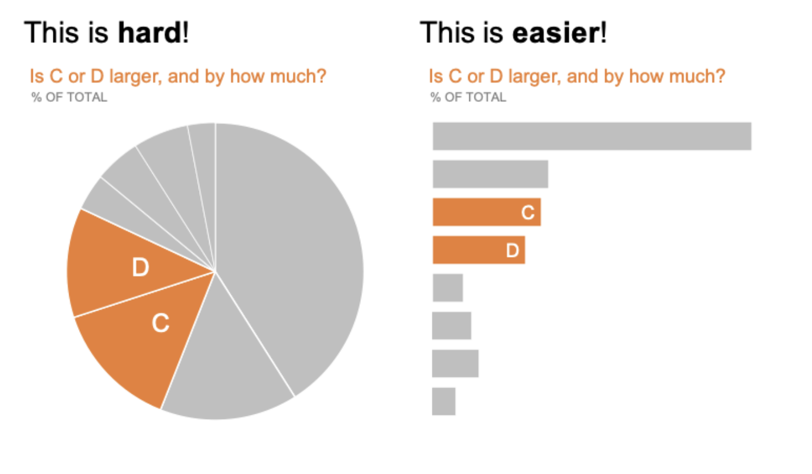

# 8. Do: Use best practices for visuals

There are many resources on chart and graph design, among them Storytelling with Data by C. N. Knaflic and The Visual Display of Quantitative Information (a classic) by Edward Tufte. Some tips are also tool-specific. But here is a shortlist of general tips, mostly from Knaflic’s book:

* **Avoid donut and pie charts** if you can. In most cases, charts that use areas (including pie and donut charts) are difficult for the human brain to process. This is especially tricky if you are comparing pie slices that are not drastically different, or comparing two pie or donut charts side by side. Try a **100% normalized stacked horizontal bar graph** instead (or a **regular vertical bar graph** with multiple series, or just **single-number graphics** on their own) (check out Knaflic pp. 234-240 for a case study “Alternatives to pies”).
  *   Example from Elizabeth Ricks’ [post](https://www.storytellingwithdata.com/blog/2020/5/14/what-is-a-pie-chart) about pie charts on the _Storytelling with Data_ blog:

      [https://www.storytellingwithdata.com/blog/2020/5/14/what-is-a-pie-chart](https://www.storytellingwithdata.com/blog/2020/5/14/what-is-a-pie-chart)\

      <figure><figcaption></figcaption></figure>
* **Avoid double Y axes**, they are not intuitive to read. Instead, you can put two charts side by side.
* When you only need to communicate one data point, a **single-number graphic** (e.g. Flipside dashboard tool has one) works great.
* A **scatterplot** shows a relationship between two metrics. You don’t have to determine whether the relationship is causal or simply correlation in order to use a scatterplot (just communicate this clearly to your audience).
* **Line charts** emphasize movement (usually through time).
* **Bar charts** are great for comparison, because human eyes find them easy to contrast. Vertical bar charts are awesome, horizontal – even better.
* Although try to **avoid stacked bar charts** if you have **more than two categories**. The visual advantage goes away and values become harder to compare. Or, you can make it normalized to 100% to help the eye.
* For more examples and tips on which type of chart to choose, check out the Storytelling with Data blog (tie-in with C.N. Knaflic’s Storytelling with Data book): [https://www.storytellingwithdata.com/chart-guide](https://www.storytellingwithdata.com/chart-guide)
