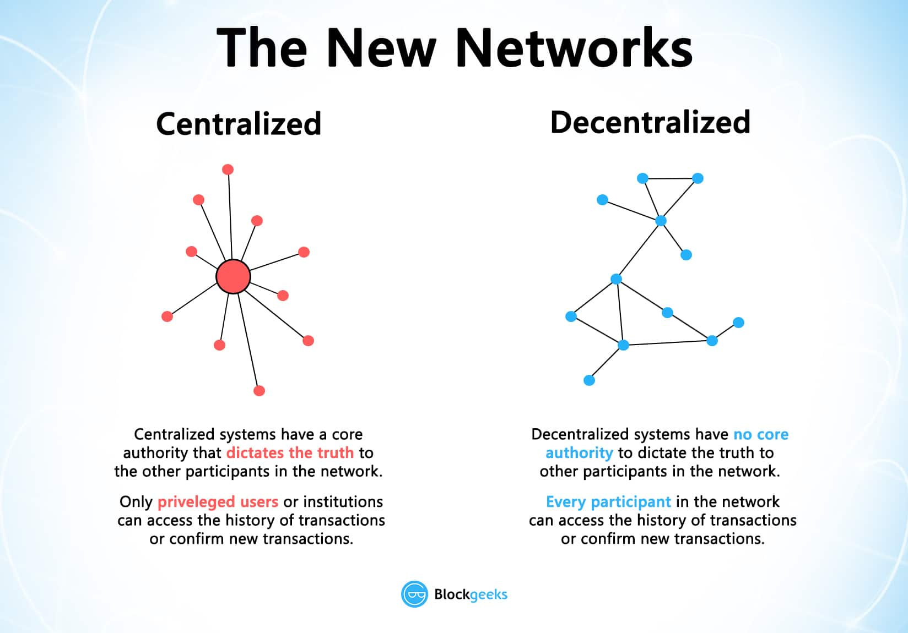
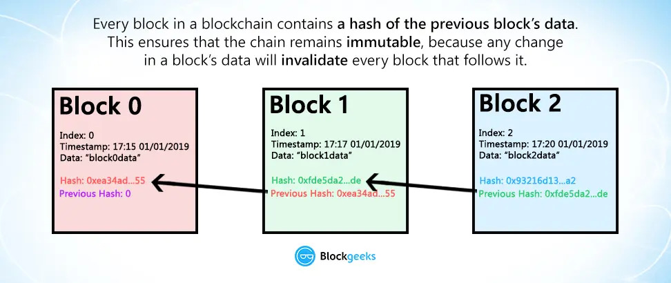

# Segment 1

## Recording


Part 1 of the first lesson in Segment 1


## Blockchain Basics

### web3

A brief review of Eshita's commentary, linked below:

* web1: Read only
  * The majority of users on the internet in the 90s were consumers on static web pages and seldom produced content.
  * Content creation was dominated by journalists and professional writers.
  * People entered the internet to consume.
* Web2: read-write
  * This evolved in the early 2000s to a new model to a term coined by Tim O’Reilly, web2.
  * Web2 made space for anyone to become a content creator and consumer. Personal blogs flourished then social media platforms emerged and cannibalized the space.
  * The current web2, as we know it, is incredibly platform dependent and those platforms rake in ad revenue on the hard work of creators.
* Web3: read-write-own
  * “Ownership is one of the biggest features of Web3 - participants have full ownership over their content, data, and assets.”


Eshita's full-length post on this evolution.


Blockchains are:

1. Decentralized: Transactions are on a network of computers (nodes).
2. Immutable: Transactions cannot be changed once committed.
3. Open: Transactions can be viewed by anyone

Decentralized networks have no core authority to dictate what a transaction contains - i.e. what has happened. Every block of information is stored across the network Ethereum is the largest ecosystem and enables rapid app development through a number of token standards and network improvements.

### Transactions

### Blocks

Blocks are written in the order that they occur and the nodes securing the network agree on this order. Each block refers to the prior block with a hash of the data secured in the preceding block. The chain that moves forward is the set of blocks that the network agrees on. No one node can alter transaction data, as it will get overruled by the network consensus

### Dive Deeper







## What is SQL?

And why do we use this particular language to analyze data?

**S**tructured **Q**uery **L**anguage, SQL (or sequel) for short, is a programming language used to interact with relational databases.&#x20;


We won't go into much detail about database design or how to set up a SQL database of your own over the course of these workshops. If you'd like to take it upon yourself to learn more, my recommendation is CS50x, or Harvard's Intro to CS course that is available for free as OpenCourseWare.

[https://cs50.harvard.edu/x/2022/notes/7/#relational-databases](https://cs50.harvard.edu/x/2022/notes/7/#relational-databases)


Ok, but again. _Why SQL? Why databases in general? I thought blockchains replaced databases with decentralized solutions?_

This is largely true, from an application perspective. Ethereum has made smart contract development and deployment quite simple, with the right skillset, and blockchains are fantastic for writing and storing data. Every interaction you make leaves a mark on the chain, generally with ease.

However, finding, extracting and reading that data is where things get complicated. Let's take a look.

## Why?

This is (and should be) a reoccuring question. Why learn all of this? What's the point, and who benefits from a robust analyst community?\
In short, everyone. It’s essential information for these blockchains and protocols. Providing metrics into what their users are doing, parsing out genuine activity from bots, tracking marketplace metrics, etc. That is all necessary to direct engineering resources to the right areas, assess the health of their network, view growth or contraction in areas, etc. All of this, especially in a bear.

There is a robust ecosystem of analysts and opportunity for work in the crypto space. For a nice overview of what's available, check out this board by Flipside Cantina member, [pinehearst](https://twitter.com/pinehearst\_).


