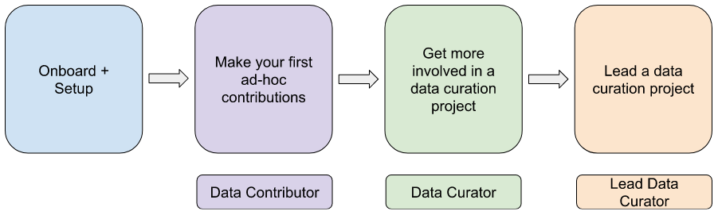

# Data Curator Onboarding

## Data Curators

Data curators at MetricsDAO build the data tables that power our bounties and analyses. Curators typically have a background in SQL, data modeling, and an interest in blockchain data.

As a data curator you have the opportunity to:

* create data tables from raw blockchain data
* improve your data modeling skills
* receive compensation for your contributions
* contribute with 1-off tasks, or join a curation project as a Data Curator, or Lead Data Curator

Our data curators come from a diverse set of backgrounds. They’ve built blockchain data models for Solana, Harmony, Near, Terra, and more. Several have continued to apply their skills in full-time blockchain and web3 industry positions.

\
Ready to contribute? &#x20;

1. Read [‘How to Get Involved with Data Curation at MetricsDAO’](./#how-to-get-involved-with-data-curation-at-metricsdao) below.
2. Reach out to forg#9122 and/or issui#6571 on Discord:\
   \
   "Hi, I’m interested in doing data curation for MetricsDAO."

## How to Get Involved with Data Curation at MetricsDAO

Contributors typically follow this path:

<figure><figcaption></figcaption></figure>

#### Onboard 

Reach out to forg#9122 and/or issui#6571 on Discord e.g.: “Hi, I’m interested in doing data curation for MetricsDAO.”

Join the weekly data curation pod sync in Discord.\

#### Get Setup

Follow the guide [here](dev-environment-setup.md) to get your machine set up with DBT, Snowflake, and Github access.

#### Join a Curation Project

Curation happens in projects by chain or protocol, e.g. Terra, Uniswap, etc.

See our list of projects [here](../data-curation/). forg#9122 and/or issui#6571 can guide you on which project to join.\

#### Make Your First Contributions as a ‘Data Contributor’

Data Contributors pick up 1-off or ‘ad-hoc’ curation tasks, often marked as “Good First Issue” in Github. These tasks are assigned by a project’s Lead Data Curator or can be picked up ad-hoc (e.g. a bug ticket).\

#### Get More Involved as a ‘Data Curator’

After you’ve made your first contributions as a Data Contributor (per above), you can choose to get more involved by joining a curation project as a Data Curator.

Data Curators serve as central contributors on projects, and leverage their experience to build full models, fix more complex bugs, and they may take ownership of multiple work streams.\

#### Lead a Data Curation Project as a ‘Lead Data Curator’

You can choose to lead a data curation project as a Lead Data Curator.

Lead Data Curators are accountable for the overall project’s outcomes, including data modeling standards, timelines, and providing coordination and thought leadership for Data Curators and Data Contributors working on a project.

\
\
Again, here is the path data curators typically follow, now with more detail & roles:

<figure><figcaption></figcaption></figure>

| Role:             | <mark style="background-color:purple;">Data Contributor</mark>                  | <mark style="background-color:green;">Data Curator</mark>                                                                              | <mark style="background-color:orange;">Lead Data Curator</mark>                                                                                  |
| ----------------- | ------------------------------------------------------------------------------- | -------------------------------------------------------------------------------------------------------------------------------------- | ------------------------------------------------------------------------------------------------------------------------------------------------ |
| Responsibilities: | 1-off or ‘ad-hoc’ curation tasks, often marked as “Good First Issue” in Github. | 
Central contributor on a project,

build full models,

fix complex bugs, may take ownership of multiple work streams.
 | Accountable for the overall project’s outcomes, including data modeling standards, timelines, and providing coordination and thought leadership. |
| Time Commitment:  | Variable, duration of task, typically 1 to several hours.                       | Typically 2-6 week(s), or the duration of 1 or more Epochs in a project (more on projects below).                                      | Typically 6-8 week(s), or the duration of several Epochs in a project (more on projects below).                                                  |
| Compensated:      | Monthly, for logged & reported work                                             | Per-project, through consensus in Coordinape.                                                                                          | Per-project, through consensus in Coordinape.                                                                                                    |
| Skills to Begin:  | SQL and interest in blockchain data.                                            | SQL, modeling standards, increased familiarity with blockchain data.                                                                   | SQL, modeling standards, blockchain data, project management.                                                                                    |

Get started by reaching out to forg#9122 and/or issui#6571 on Discord e.g.: “Hi, I’m interested in doing data curation for MetricsDAO.”
