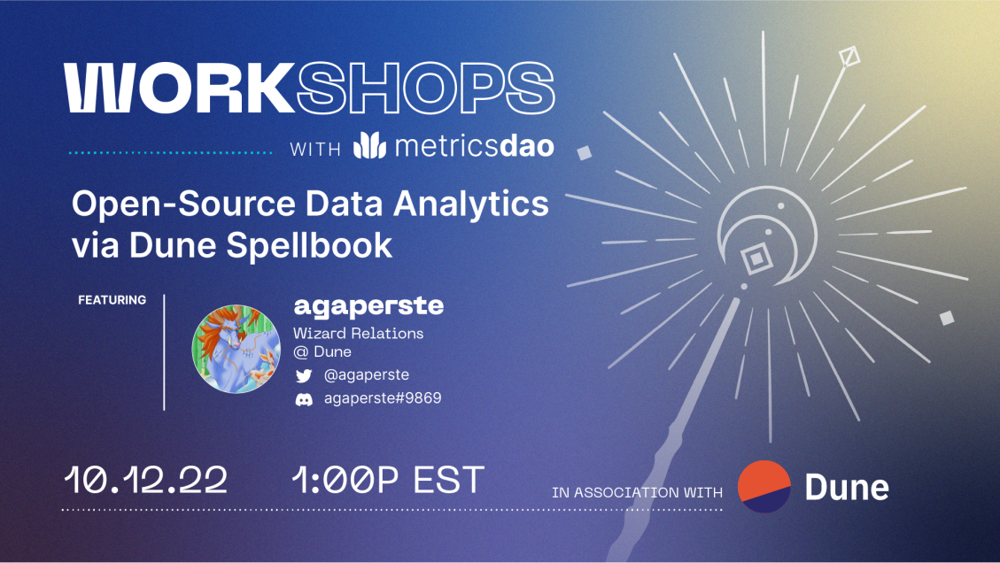

# 2022-10-12 Open-Source Data Analytics via Dune Spellbook (Prerequisites)

<figure><figcaption></figcaption></figure>

On 12 October 2022 at 1pm ET | 5pm UTC, MetricsDAO will host a workshop by [agaperste](https://twitter.com/agaperste) on doing open-source data analytics with Dune Spellbook – a web3 community data transformation project.&#x20;

Spellbook is an open-source dbt [repository](https://github.com/duneanalytics/spellbook) for high level data tables. It enables community to build toward a standardized way to transform data into meaningful abstraction layers.&#x20;

This is the list of prerequisites strongly recommended before you go to a Spellbook workshop!&#x20;

1. Have [Python 3.9](https://realpython.com/installing-python/) installed on your computer.&#x20;
2. Install an IDE to edit your code. [VSCode](https://code.visualstudio.com/) is a nice free one.&#x20;
3. Ensure that [pip](https://pip.pypa.io/en/stable/installation/) is installed.&#x20;
4. Install [pipenv](https://pypi.org/project/pipenv/), this will allow us to create a virtualenv with dbt.
5. Set up [git and github](https://docs.github.com/en/get-started/quickstart/set-up-git) including authentication.&#x20;
6. Make a [fork](https://docs.github.com/en/get-started/quickstart/fork-a-repo) of the [spellbook repo](https://github.com/duneanalytics/spellbook), including cloning locally and adding an upstream.&#x20;
7. Review Github’s [instructions](https://docs.github.com/en/pull-requests/collaborating-with-pull-requests/proposing-changes-to-your-work-with-pull-requests/creating-a-pull-request-from-a-fork) on how to make a pull request from a fork.&#x20;

P.S. If you have trouble with these prerequisites, please join Dune's :mage: [Community Discord](https://discord.gg/BJBHFR6sdy) and reach out for help in the [#📜spellbook](https://discord.com/channels/757637422384283659/999683200563564655) channel!&#x20;

Join this workshop in MetricsDAO's [Discord server](https://discord.gg/metrics)! Have questions about attending this event? Reach out on MetricsDAO's discord in [# 📄 | Workshops](https://discord.com/channels/902943676685230100/930896424051282000).
