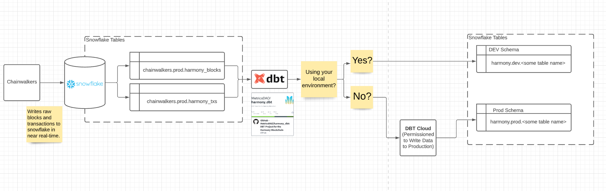

# Data Curator Onboarding

### Access

**Github (ask danner.eth#7297)**

* Hi Drake, I’m interested in doing data curation for MetricsDAO, could you give me github access please? My github profile is: \[https://github.com/antonyip]

**Snowflake (ask danner.eth#7297 / j1mmy#3666)**

* Hi Drake, I’m interested in doing data curation for MetricsDAO, could you give me snowflake access please? I’d like my username to be: \[ant]

**dbt cloud \[Optional]**

* (Sign up on your own: [https://www.getdbt.com/signup/](https://www.getdbt.com/signup/) )

#### Setup

* (Optional) Install dbt on your terminal: [https://docs.getdbt.com/dbt-cli/install/overview](https://docs.getdbt.com/dbt-cli/install/overview)
* Install Git (if you don’t have it): [https://git-scm.com/book/en/v2/Getting-Started-Installing-Git](https://git-scm.com/book/en/v2/Getting-Started-Installing-Git)
* Get Docker ( [https://docs.docker.com/get-docker/](https://docs.docker.com/get-docker/) )
* Follow Docker setup
  * [https://github.com/MetricsDAO/harmony\_dbt#readme](https://github.com/MetricsDAO/harmony\_dbt#readme)
* Clone the project or MetricsDao Github repo `git clone https://github.com/MetricsDAO/harmony_dbt`
* Copy `.env.sample` and create `.env`, replace the highlights below with your own account and passwords
*  (1) (2).png>)
* Install the dbt formatter from VS Code. For ease of use, turn on "format on save" by searching for "format" in the settings menu.
  * henriblancke.vscode-dbt-formatter

#### Channels

Drop your questions in the Curator’s Channel (Let's open it up to the public / People can leave feedback relating to the data in the snowflake database.)

#### Simple Walkthrough of How to Contribute

This is going to be a very rough guide on what is expected. You can consider it as a living document that will get updated again and again.

#### Workshop on Data Curation and dbt

chuxin.eth ran a workshop in March 2022 on using dbt to curate tables. Feel free to follow-up with any questions from this in Discord!


Data Curation with Chuxin


#### The sql/dbt style guide we follow


https://github.com/dbt-labs/corp/blob/master/dbt\_style\_guide.md


#### Expected outputs

1. Table that is consumable by the public with proper documentation.
2. Documentation that gets generated on [https://docs.harmony.metricsdao.xyz](https://docs.harmony.metricsdao.xyz).
3. Snowflake Marketplace data access.

#### Steps to start contributing:

1. Pick a task from Metrics Dao issue board:
   * Harmony: [https://github.com/MetricsDAO/harmony\_dbt/issues/](https://github.com/MetricsDAO/harmony\_dbt/issues/)
   * NEAR: [https://github.com/MetricsDAO/near\_dbt/issues](https://github.com/MetricsDAO/near\_dbt/issues)
2. Design the database schema or figure it out as you go depending on your style. In this working example, we will try recreating harmony.prod.blocks (\[Database].\[Schema].\[Table Name]).
   * See proposed table schema here: [https://github.com/MetricsDAO/harmony\_dbt/issues/2](https://github.com/MetricsDAO/harmony\_dbt/issues/2)
3. Start writing code in the snowflake UI to get a table.
   * You can skip to step 4-5 if you are able to start writing dbt-like SQL directly.
   * We are going to build on top of the staging table harmony.prod.stg\_blocks(see below).
   * .png>)
4. Convert snowflake UI code to dbt cloud code. dbt combines sql with Jinja, see more: [https://docs.getdbt.com/docs/building-a-dbt-project/jinja-macros](https://docs.getdbt.com/docs/building-a-dbt-project/jinja-macros)
   * You can copy the code directly from this file and test it out on dbt cloud: [https://github.com/MetricsDAO/harmony\_dbt/blob/main/models/core/blocks.sql](https://github.com/MetricsDAO/harmony\_dbt/blob/main/models/core/blocks.sql)
5. Copy dbt cloud code into the correct folder for the table. If you're using command line, remember to git pull (gup) from the main branch for latest updates and git checkout -b (gcb ) to create a working branch locally.
   * For this working example, you can do gcb yourname-test-blocks
   * .png>)
   * If you want to build the blocks table in dev, you can rename your sql file as yourname\_blocks.sql
   * .png>)
6. Test it using the commands make `dbt-console` and then `dbt run` to run the entire project’s models on the snowflake database (It’ll take around 30 minutes). If you only want to test your own model, you can use the command `dbt run --select your_table_name`. See highlighted commands below:
   * 
   * Once it finishes running, you'll be able to see the table available in dev
7. Make sure your table successfully runs in the dev environment before pushing your branch. Command + D to exit Docker environment. git add all the changes you want to include in the branch, and then add git commit -m "your message". Push your branch to remote using git push or gp (follow what's suggested in the terminal if it's your first time pushing the branch to remote).
   * .png>)
8. If your PR is adding or changing existing models or documentation, run `dbt docs generate` as the last commit to ensure documentation updates to include your changes.
9. Create Pull Request ( [https://github.com/MetricsDAO/harmony\_dbt/compare](https://github.com/MetricsDAO/harmony\_dbt/compare) ) and write a summary on your updates/changes, as well as attaching passing test logs.
10. Request Reviewer (From one of the leaders below).
11. Fix Review Comments.
12. Re-Request Reviewer after fixing review comments.
13. If your PR has been approved, merge it to production (Production is scheduled to run every 6 hours).
14. Congratulations! You’ve successfully contributed a table to MetricsDAO.
15. Testboard \[Optional]: If you’d like to have some sort of testing
    * [https://app.snowflake.com/us-east-1/dqa62717/harmony-tests-d7xiPyK2v](https://app.snowflake.com/us-east-1/dqa62717/harmony-tests-d7xiPyK2v)
    * dbt test

#### Keys to Success

* Ask for help!
* Pair programming - ask in the Curator channel to partner with someone.

#### Leaders (Good for Pairing!)

* Antonidas#8491 (Ant)
* nosugar🍀#1554 (Chuxin)
* MasterChETH#6807 (Matt)
* forg#9122 (Jack)

### MetricsDAO Created Tables

#### Harmony Transactions

https://docs.harmony.metricsdao.xyz/#!/model/model.harmony.txs

#### Existing resources

* https://metricsdao.gitbook.io/internal-wiki/project-teams/analytics-stack
* https://www.getdbt.com/docs/
* https://rogerdudler.github.io/git-guide/

## FAQ

* C:\Users\ant>make 'make' is not recognized as an internal or external command, operable program or batch file. Install make for windows @ http://gnuwin32.sourceforge.net/packages/make.htm
* Something doesn’t work on the docker container. Try git clean -xdf to clean up the whole repo. Your .env file will be removed and thus please remember to save your password.
* What Python version can I use? As of v1.0.0, dbt-core is compatible with Python versions 3.7, 3.8, and 3.9.
